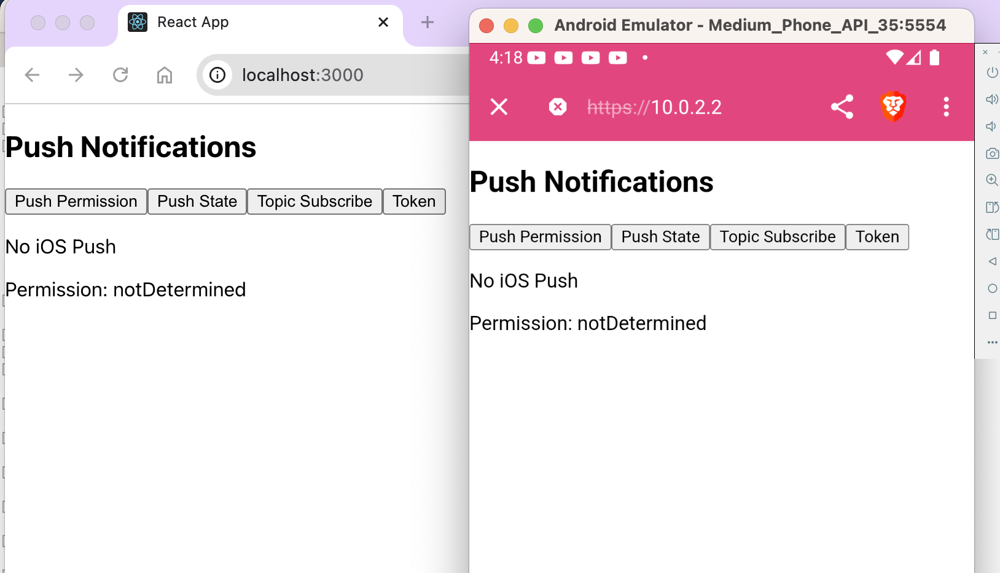

This repository is my guide to remembering the tips I have learned that allow me to create as simple as possible android applications using pwabuilder.com. 

## Execute locally the application to be displayed on the PWA and display it in the Android simulator

The first thing is to have a development environment that allows you to quickly work with the application locally and at the same time to see the changes in the android simulator to adjust what we want to obtain. To do this we must take into account:

- pwabuilder.com creates by default the application to a site using SSL (https). 
- You can access the host operating system using the address 10.0.0.2 from the Android simulator (if you have a page running for example in react on the host at the URL: http://localhost:3000, you can access it from Chrome in the Android simulator by typing in the URL: http://10.0.0.2:3000). 

To access directly from the simulator to a page that we are running on the host operating system, but that is accessed using SSL, we will create a reverse proxy with the help of nginx (as a sample I will configure everything with macOSx but in gnu/Linux it is similar). 

- Install Nginx:

```sh
brew install nginx
```

To find out where the configuration file is located we can run: `nginx -t`. Knowing the path we can add the following configuration to redirect any https from localhost to http://localhost:3000 -> `sudo nano /path-to-conf-file/nginx.conf`:

```
http {
    # Configuración HTTPS para el puerto 443 y redirección al puerto 3000
    servidor {
        listen 443 ssl;
        nombre_servidor localhost;

        ssl_certificate /Users/test/workspace/nginx/localhost.pem;
        ssl_certificate_key /Users/test/workspace/nginx/localhost-key.pem;

        ubicación / {
            proxy_pass http://localhost:3000;
            proxy_set_header Host $host;
            proxy_set_header X-Real-IP $dirección_remota;
            proxy_set_header X-Forwarded-For $proxy_add_x_forwarded_for;
            proxy_set_header X-Forwarded-Proto $scheme;
        }
    }
  }
```

Save and run nginx:

```sh
sudo nginx -s reload
```

Create the PWA application to generate the .pkg file that we will run in the Android simulator. To do this I will use as an example the site https://khmyznikov.com/ios-pwa-shell/ but it can be the one we are developing if there is already a public site on the internet accessible with SSL and that contains a manifest.json file necessary for it to work as a PWA application. Go to https://www.pwabuilder.com/reportcard?site=https://khmyznikov.com/ios-pwa-shell/ and change:

**Host**: 10.0.2.2

**Start URL**: /

We can leave the other parameters as they are unless we want to enable **Location delegation** and **Google Play billing** if we want to use those features. Generate the package with *Download Package* and then unzip the generated file and drag the .pkg file to the simulator for installation. 



*Make sure that the application to be developed is running locally (in our case at http://localhost:3000) so that some content can be displayed in the simulator.*
